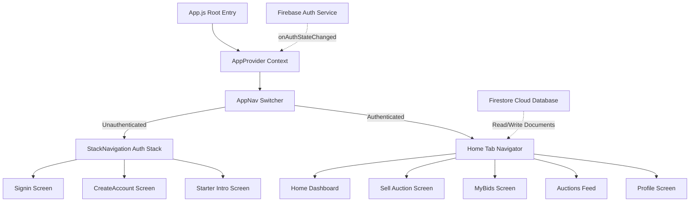
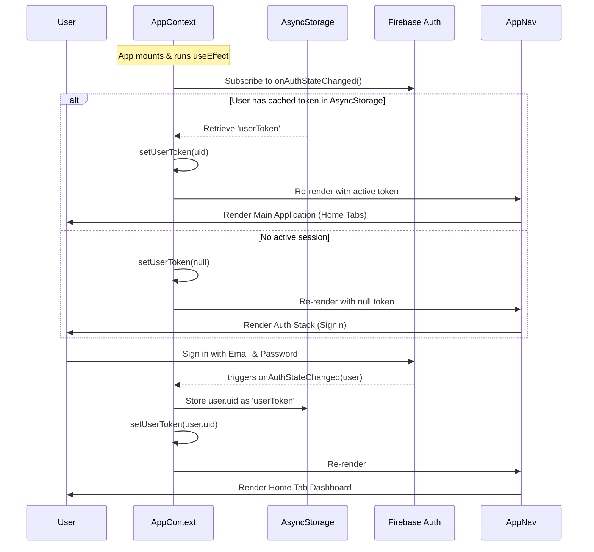

# Rebid - Architecture Design Document

This document explains the technical architecture, data model, state management, and navigation systems within the `rebid-app`.

---

## 🏛️ System Architecture Overview

The app follows a decoupled client-server architecture. The mobile front-end is developed with **React Native / Expo** and uses **Firebase** for backend database services, real-time synchronization, and user session management.



---

## 🧭 Navigation Hierarchy

Rebid separates routing into two states based on the presence of an active authentication session:

1. **Authentication Stack (`StackNavigation`)**:
   * Initial screen: `sign-in`
   * Navigational routes:
     * `sign-in` ➡️ Displays login form.
     * `create-account` ➡️ Form to register a new account.
     * `starter` ➡️ Introduces the app after successful login.
     * `my-home` ➡️ Safe navigation to main tabs.
     
2. **Main Application Tabs (`Home`)**:
   * Built on a bottom tab navigator containing:
     * **Home (Dashboard)**: Expiring-soon and recent listings feed.
     * **Sell**: A form to list new products for auction.
     * **Bids**: View and manage ongoing bids.
     * **History**: View past auction and transaction histories.
     * **Profile**: View statistics (Total Earned, listed products) and manage user configurations.

---

## 🔄 State Management & Authentication Flow

Global state is managed by `AppContext` located in `config/app-context.js`. The context provides:
* `userToken`: Unique token (UID) of the currently authenticated user.
* `UID`: The Firestore-aligned User UID.
* `isLoading`: Global loading indicator state while reading stored sessions or logging in.
* `login`: Helper method to manually override or cache credentials.
* `logout`: Handles Firebase Sign Out and removes cached sessions from storage.

### Onboarding & Session Verification Flow:



---

## 📊 Database Models & Structures

Rebid integrates with **Google Cloud Firestore**. The structure is flat and organized into two collections:

### 1. `users` Collection
* **Document ID**: `uid` (Matches Firebase Auth UID)
```json
{
  "firstName": "John",
  "lastName": "Doe",
  "email": "john.doe@gmail.com",
  "createdAt": 1700000000000
}
```

### 2. `auctions` Collection
* **Document ID**: Auto-generated hash
```json
{
  "title": "Dual-Camera Pro Drone with GPS",
  "description": "High-end quadcopter drone with 4K recording, GPS hold...",
  "initialPrice": "150000",
  "bidIncrement": "5000",
  "photoUrl": "https://images.unsplash.com/photo-1527977966376-1c8408f9f108",
  "endDate": "12/06/2026",
  "createdAt": 1700000050000
}
```
