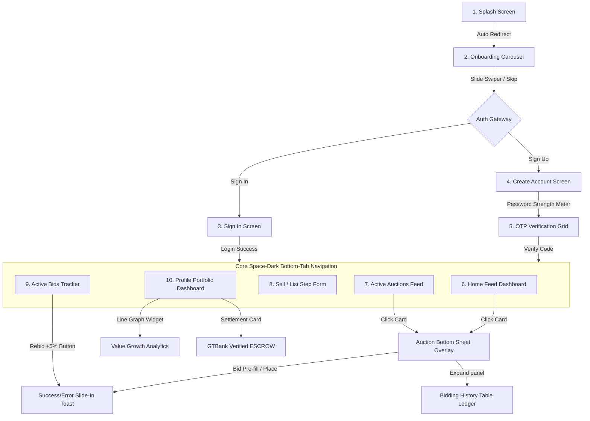

# 🚀 Rebid — Premium Nigerian Auction Marketplace

Rebid is a high-fidelity, portfolio-ready mobile auction marketplace app designed to a **2026 premium space-dark standard**. Fully built with **React Native (Expo)**, it provides collectors with real-time bidding, urgency timers, dynamic escrow management, and portfolio dashboards.

A fully interactive CDN desktop simulator is included, letting you browse all 10 screens instantly in any web browser.

---

## 📱 Interactive Web Simulator

Experience a full virtual smartphone mockup of all 10 screens, complete with ticker countdowns, Formik swipers, live bidding calculations, and detail drawer overlays directly in your desktop browser:

👉 **[Open Local Simulator (rebid_interactive_mockup.html)](file:///c:/Users/DEVINE/Documents/rebid-app/rebid_interactive_mockup.html)**

---

## 🗺️ Visual UI Flow Layout

Below is the user flow mapping the navigation tree from initial boot to checkout/settlement:



---

## 🎨 2026 Space-Dark Design Tokens

We have implemented an ultra-premium, dark-first visual palette designed to feel modern and trustworthy:

* **Background (Canvas)**: Space Dark `#080D18`
* **Primary Cards**: Midnight Slate `#0F1625`
* **Elevated Surfaces**: Glass Navy `#161E30`
* **Primary Accent**: Electric Coral `#FF6B35`
* **Winning State**: Emerald Green `#00D97E`
* **Outbid Alert**: Rose Crimson `#FF4560`
* **Premium Accents**: Amber Gold `#F5C518`
* **Borders**: 1px Solid Glass Borders `rgba(255,255,255,0.06)`

---

## 📱 The 10 Overhauled Screens

### 1. Splash Screen
High-impact opening screen using a bold tagline, letter-spaced branding, centered **Rebid** wordmark, and double CTA stacks linking directly to onboarding sequences.

### 2. Onboarding Carousel
A 3-screen swiper displaying custom-styled vector gavel, trophy, and cash illustrations detailing how to browse, bid, and sell high-value lots.

### 3. Sign In Screen
Sleek top third diagonal backdrop with floating labels, custom focus rings, social single sign-on buttons (Google), and toggles for password viewing.

### 4. Create Account
Includes an automatic **4-segment password strength meter** changing colors (Red ➔ Orange ➔ Yellow ➔ Green) to prompt secure signup patterns.

### 5. OTP Email Verification
Custom 6-digit input boxes. Shifting focus automatically tracks characters, combined with ticking countdown resend timers.

### 6. Home Feed Dashboard
Frosted search bars, horizontal category pills, full-bleed gradient cards with **urgency color-coded countdowns** (Green: >24h, Yellow: <12h, Red: <1h), and designed skeleton card loaders.

### 7. Active Auctions Feed
Complete search indices, live category filters, watchlist favorite hearts, and commas-formatted Naira listings (`₦145,000,000`).

### 8. Sell / List Form
A clean, background-free off-white form utilizing **1 ➔ 2 ➔ 3 step indicators**, a dashed camera upload zone, and clear input bounds.

### 9. Active Bids Tracker
A workspace showcasing real-time bidding results. Winning items glow in emerald shadow, and outbid items glow in crimson shadow with a quick-increment **Rebid +5%** button.

### 10. Profile Portfolio Dashboard
An elite investor center highlighting total portfolio growth via an **interactive SVG Line Graph**, overlapping metrics cards, GTBank Verified Metal Membership plates, and ledger download shortcuts.

---

## 🛠️ Codebase Structure

```text
rebid-app/
├── assets/                    # Images, mock data and static assets
│   ├── demo-products.js       # Premium mock products
│   └── categories.js          # Unified categories and icons
├── config/                    # Contexts and themes
│   ├── theme.js               # Space-dark unified guidelines
│   ├── theme-context.js       # Light/Dark context wrapper
│   └── app-context.js         # Firebase Authentication context
├── screens/                   # The 10 Upgraded Screen components
│   ├── Splash.js              # Screen 1
│   ├── Onboarding.js          # Screen 2
│   ├── Signin.js              # Screen 3
│   ├── CreateAccount.js       # Screen 4
│   ├── Verification.js        # Screen 5
│   ├── Home.js                # Screen 6 (Dashboard, Tabs & FAB)
│   ├── Auctions.js            # Screen 7
│   ├── Sell.js                # Screen 8
│   ├── MyBids.js              # Screen 9
│   ├── Profile.js             # Screen 10
│   ├── LiveBidding.js         # Auction Detail bottom-sheet drawer
│   └── stack-navigation.js    # Stack routers
├── utilities/                 # Cross-app indicators & utilities
│   ├── comma-sep-num.js       # Commas number formatter
│   └── ToastService.js        # Slide-in success & outbid toast alerts
├── App.js                     # Main entry
├── app.json                   # Expo configs
└── rebid_interactive_mockup.html # Local Browser Interactive Mockup
```

---

## 🚀 Getting Started

### 1. Install Dependencies
Ensure you have Node.js and npm installed, then run:
```bash
npm install
```

### 2. Start the Development Server
```bash
npm run start
```
* Press `a` in the terminal to load the **Android Emulator**.
* Press `i` to load the **iOS Simulator**.
* Scan the terminal **QR Code** using Expo Go to view directly on your phone.
